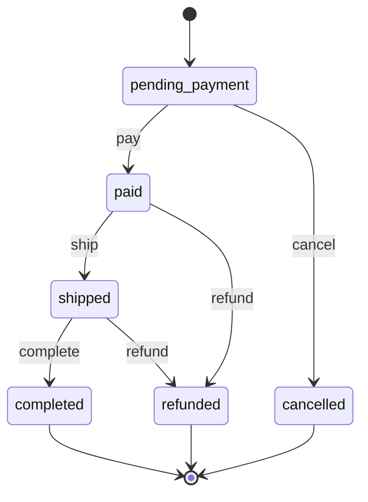
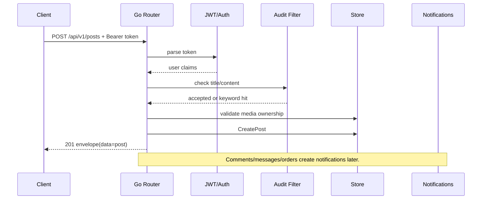

# API And Data Flow

Last updated: 2026-05-27

This document maps the current Go API, domain models, persistence strategy, and
client contracts.

## 1. Response Envelope

All JSON API responses use the envelope in `internal/platform/api/router.go`:

```json
{
  "code": 0,
  "message": "ok",
  "data": {}
}
```

Created responses use HTTP `201` with `message: "created"`. Errors use the HTTP
status as `code` and a human-readable `message`.

Clients that unwrap the envelope:

- Web: page scripts call `window.MeowShared` helpers or local fetch helpers.
- Expo: `mobile/src/api.ts` uses `unwrapEnvelope`.
- KMP: `MeowCircleSdk.unwrapData()` decodes `ApiEnvelope`.

## 2. Auth And Admin

| Concern | Current Behavior |
| --- | --- |
| User auth | `Authorization: Bearer <jwt>` |
| JWT | HS256, issued by `internal/platform/auth/jwt.go`, default expiry 72h. |
| Password | PBKDF2-SHA256 with per-user salt. |
| Login rate limit | 5 failed attempts per username/IP within 10 minutes; returns 429. |
| Registration phone verification | Optional normalized phone + SMS code through `phoneotp.Store`. |
| Admin auth | Header `X-Admin-Key`, default `admin123`, override with `ADMIN_KEY`. |
| CORS | `CORS_ALLOW_ORIGIN`, default `*`; allowed headers include `Content-Type`, `Authorization`, `X-Admin-Key`. |

## 3. Route Map

### Health

| Method | Path | Auth | Purpose |
| --- | --- | --- | --- |
| `GET` | `/healthz` | no | Service health and current store kind. |
| `GET` | `/readyz` | no | Readiness check. |

### Auth And Users

| Method | Path | Auth | Purpose |
| --- | --- | --- | --- |
| `POST` | `/api/v1/auth/register` | no | Register and return JWT + user. |
| `POST` | `/api/v1/auth/send-verification-code` | no | Send/create phone verification code. |
| `POST` | `/api/v1/auth/login` | no | Login and return JWT + user. |
| `GET` | `/api/v1/auth/me` | bearer | Current user. |
| `PATCH` | `/api/v1/me` | bearer | Update nickname/avatar/bio. |
| `GET` | `/api/v1/users/{id}` | no | Public profile. |

### Search

| Method | Path | Auth | Purpose |
| --- | --- | --- | --- |
| `GET` | `/api/v1/search?q=&type=all|post|listing` | no | Search posts and listings. |

### Posts And Social

| Method | Path | Auth | Purpose |
| --- | --- | --- | --- |
| `GET` | `/api/v1/posts?page=&page_size=&filter=rec|follow` | optional | Feed list with author, like count, liked state, first media. |
| `POST` | `/api/v1/posts` | bearer | Create post after moderation and media ownership checks. |
| `GET` | `/api/v1/posts/{id}` | optional | Post detail with author, media, comments, likes, follow state. |
| `PATCH` | `/api/v1/posts/{id}` | bearer owner | Update own post. |
| `DELETE` | `/api/v1/posts/{id}` | bearer owner | Delete own post. |
| `POST` | `/api/v1/posts/{id}/comments` | bearer | Add comment and notify post author. |
| `POST` | `/api/v1/posts/{id}/like` | bearer | Toggle like. |
| `GET` | `/api/v1/me/posts` | bearer | Current user's posts. |
| `POST` | `/api/v1/me/follow/{userID}` | bearer | Follow user. |
| `DELETE` | `/api/v1/me/follow/{userID}` | bearer | Unfollow user. |

### Listings And Market

| Method | Path | Auth | Purpose |
| --- | --- | --- | --- |
| `GET` | `/api/v1/listings?page=&page_size=` | no | Listing feed. |
| `POST` | `/api/v1/listings` | bearer | Create listing after moderation and media ownership checks. |
| `GET` | `/api/v1/listings/{id}` | no | Listing detail with media. |
| `PATCH` | `/api/v1/listings/{id}` | bearer owner | Update own listing. |
| `DELETE` | `/api/v1/listings/{id}` | bearer owner | Delete own listing. |
| `GET` | `/api/v1/me/listings` | bearer | Current user's listings. |

### Media And Reports

| Method | Path | Auth | Purpose |
| --- | --- | --- | --- |
| `GET` | `/api/v1/media` | bearer | Current user's media. |
| `POST` | `/api/v1/media` | bearer | Multipart upload, field name `file`. |
| `GET` | `/api/v1/media/{id}` | no | Media detail. |
| `DELETE` | `/api/v1/media/{id}` | bearer owner | Delete own media. |
| `POST` | `/api/v1/reports` | bearer | Report post/comment/listing/media. |
| `GET` | `/uploads/{filename}` | no | Static uploaded media file. |

### Messages And Notifications

| Method | Path | Auth | Purpose |
| --- | --- | --- | --- |
| `GET` | `/api/v1/notifications?unread=true` | bearer | Notifications and unread count. |
| `POST` | `/api/v1/notifications/{id}/read` | bearer | Mark one notification read. |
| `POST` | `/api/v1/notifications/read-all` | bearer | Mark all notifications read. |
| `GET` | `/api/v1/me/conversations` | bearer | Conversation list. |
| `GET` | `/api/v1/me/conversations/{peerID}` | bearer | Messages with peer, marks conversation read. |
| `POST` | `/api/v1/messages` | bearer | Send message after moderation and notify recipient. |

### Orders And Payments

| Method | Path | Auth | Purpose |
| --- | --- | --- | --- |
| `GET` | `/api/v1/payments/methods` | no | Supported payment methods. |
| `POST` | `/api/v1/orders` | bearer buyer | Create order from listing. |
| `GET` | `/api/v1/orders/{id}` | bearer participant | Order detail. |
| `POST` | `/api/v1/orders/{id}/pay` | bearer buyer | Pay pending order. |
| `POST` | `/api/v1/orders/{id}/cancel` | bearer buyer | Cancel pending order. |
| `POST` | `/api/v1/orders/{id}/ship` | bearer seller | Mark paid order shipped. |
| `POST` | `/api/v1/orders/{id}/complete` | bearer buyer | Confirm shipped order received. |
| `POST` | `/api/v1/orders/{id}/refund` | bearer seller | Refund paid/shipped order. |
| `GET` | `/api/v1/me/orders?role=buyer|seller` | bearer | Current user's orders. |

### Admin

All admin endpoints require `X-Admin-Key`.

| Method | Path | Purpose |
| --- | --- | --- |
| `GET` | `/api/v1/admin/summary` | Counts for users/posts/listings/comments/reports/media/orders. |
| `GET` | `/api/v1/admin/posts` | All posts. |
| `DELETE` | `/api/v1/admin/posts/{id}` | Delete post. |
| `GET` | `/api/v1/admin/comments` | All comments. |
| `DELETE` | `/api/v1/admin/comments/{id}` | Delete comment. |
| `GET` | `/api/v1/admin/listings` | All listings. |
| `DELETE` | `/api/v1/admin/listings/{id}` | Delete listing. |
| `GET` | `/api/v1/admin/media?status=pending|approved|rejected` | Media moderation queue. |
| `POST` | `/api/v1/admin/media/{id}/approve` | Approve media. |
| `POST` | `/api/v1/admin/media/{id}/reject` | Reject media. |
| `DELETE` | `/api/v1/admin/media/{id}` | Force delete media. |
| `GET` | `/api/v1/admin/reports?status=open|resolved|dismissed` | Report queue. |
| `GET` | `/api/v1/admin/reports/{id}` | Report detail. |
| `POST` | `/api/v1/admin/reports/{id}/resolve` | Resolve report. |
| `POST` | `/api/v1/admin/reports/{id}/dismiss` | Dismiss report. |
| `GET` | `/api/v1/admin/orders` | All orders. |
| `GET` | `/api/v1/admin/audit-logs?limit=100` | Audit log list. |

## 4. Core Domain Model Map

| Model | Important Fields | Used By |
| --- | --- | --- |
| `User` | username, nickname, phone, avatar, bio, password hash/salt | Auth, profile, posts, messages, orders. |
| `Post` | author, title, content, category, tags, media IDs, last reply | Feed, detail, comments, search. |
| `Comment` | post, author, content | Post detail, notifications, admin. |
| `Listing` | seller, type, title, description, price, media IDs | Market, orders, messages. |
| `Media` | owner, kind, mime, size, filename, URL, status | Uploads, post/listing attachments, review. |
| `Report` | reporter, target kind/id, reason, status, resolution | Safety/admin. |
| `Order` | buyer, seller, listing, amount, status, payment method/tx | Commerce workflow. |
| `Notification` | user, kind, title/body, ref, actor, image, read | Notification center and badges. |
| `Message` | sender, recipient, content, read | Direct messages. |
| `AuditLog` | actor, action, target, note, IP | Admin accountability. |

## 5. Order State Machine



Guards:

- Buyer can pay and cancel.
- Seller can ship and refund.
- Only buyer can complete.
- Participants can view order detail.

## 6. Write Path Example: Create Post



## 7. Client Contract

| Client | Contract Notes |
| --- | --- |
| Web | Uses `localStorage` keys `meow_token` and `meow_user`; do not rename without migrating scripts. |
| Expo | Uses SecureStore keys `meow.auth.token` and `meow.auth.user`; API base from `EXPO_PUBLIC_API_URL`, Android emulator fallback `10.0.2.2`. |
| KMP | `MeowCircleSdk` stores token/user JSON in `SessionStore`, uses Ktor, and points Android emulator at `10.0.2.2` by default. |

## 8. Persistence Notes

The `Store` interface currently returns zero values/false rather than propagating
errors. Postgres implementations log errors internally. This keeps handlers
simple for MVP, but means production-grade observability should include logs and
admin/health checks.

Redis cache is a read-through decorator for selected reads. Writes evict related
keys. User-specific lists and participant-specific data bypass shared cache to
avoid cross-user leakage.

## 9. Change Checklist For Domain/API Work

When adding a field or feature:

1. Update `internal/domain/models.go`.
2. Update `internal/store/store.go` if persistence behavior changes.
3. Update `internal/store/memory.go`.
4. Update relevant `internal/store/postgres/*.go`.
5. Add a new migration.
6. Update API handler validation/response.
7. Update Web scripts and i18n copy if visible.
8. Update `mobile/src/api.ts` types and KMP `Models.kt`.
9. Update docs in `docs/`.
10. Run only checks approved for the current machine. On this machine, default to static review and Web smoke checks; do not run Go build/run/test or Gradle.
