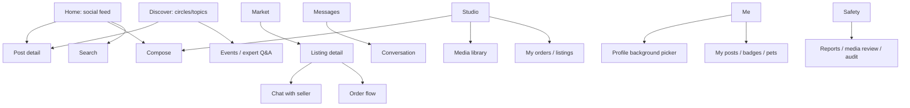

# Meow Circle Cute Figma & Web Redesign

> Version: 1.0  
> Date: 2026-05-25  
> Goal: abandon the Stitch visual/layout system, keep only product capabilities, and rebuild Meow Circle as a cute, polished, themeable social-commerce experience for teen and young adult users.

## 1. Redesign Decision

Stitch is now treated only as a functional reference. Its layout, visual hierarchy, spacing, card shapes, navigation, and screen composition can be discarded.

The new product direction is:

- Cute first, but still usable and trustworthy.
- Designed for young users: playful, expressive, visual, fast to scan.
- Social feed + cute discovery + pet marketplace + private chat + profile customization.
- Global theme switching across the whole app.
- "My/Profile" page supports switchable background images.
- Three independent UI deliverables are required: Mobile, Desktop, and WebUI. They share the Pawpop brand system but do not share layout assumptions.
- WebUI has an independent browser product layout instead of copying mobile or Stitch.

## 2. Audience

Primary audience:

- Teen and young adult pet lovers.
- Users who like cute visual identities, profile decoration, collecting, posting, and social discovery.
- Buyers/sellers who need pet supplies, adoption info, services, and trusted chat.

Design implications:

- Use vivid but controlled color.
- Use real pet imagery and expressive surface treatments.
- Keep actions obvious and thumb-friendly.
- Make profile identity customizable.
- Avoid sterile SaaS dashboards for normal users.
- Keep admin/trust screens denser and more serious, but still visually aligned.

## 3. Product Name For Design System

Design system name:

`Pawpop`

Brand sentence:

`A soft-pop pet universe for sharing, discovering, chatting, and trading safely.`

Visual keywords:

- Soft pop
- Sticker-like
- Pet diary
- Pocket universe
- Teen magazine meets social app
- Cute but not childish
- High-contrast CTAs
- Customizable identity

## 4. Figma File Structure

Create a Figma file:

`Meow Circle Pawpop Redesign`

Pages:

| Page | Purpose |
| --- | --- |
| `00 Cover` | Brand direction, audience, status |
| `01 Product Map` | Capabilities from current project and new IA |
| `02 Pawpop Tokens` | Color, typography, spacing, radius, shadows, themes |
| `03 Components` | Buttons, chips, cards, nav, feed tile, listing card, chat, profile bg picker |
| `04 Mobile App` | Home, Discover, Market, Messages, Profile, Compose |
| `05 Desktop App` | Desktop client / efficiency workspace layouts |
| `06 WebUI` | Browser-facing Web product layouts |
| `07 Profile Customization` | Profile background switcher, avatar frames, badges, pet identity |
| `08 Trust & Commerce` | Order states, report flow, media review, seller trust |
| `09 Admin Console` | Moderation, reports, media queue, audit log |
| `10 Prototypes` | Browse, publish, market, chat, profile customize, moderate |
| `11 Future Concepts` | Pet profiles, care diary, clubs, expert Q&A, adoption flow |

## 4.1 Three Independent UI Sets

This redesign has three separate deliverables:

| Set | Repo Entry | Figma Page | Design Intent |
| --- | --- | --- | --- |
| Mobile | `web/pawpop-mobile.html` | `04 Mobile App` | Native app-like, thumb-first, screen-by-screen phone experience |
| Desktop | `web/pawpop-desktop.html` | `05 Desktop App` | Desktop client / efficiency workspace with split panes and dense tools |
| WebUI | `web/cute.html` | `06 WebUI` | Browser-facing product UI with left dock, center stage, and right rail |

The overview page is:

`web/pawpop.html`

Rules:

- Mobile is not a shrunken WebUI.
- Desktop is not a widened mobile app.
- WebUI is the browser product experience and may be responsive, but it remains its own design set.
- All three share tokens, themes, imagery direction, tone, and core components.
- All three include the same functional coverage: auth, feed, post detail, discover, market, listing detail, messages, notifications, profile/background switch, compose, media, orders, and safety/admin.

Required Web frames:

- `Web / Home`
- `Web / Post Detail`
- `Web / Discover`
- `Web / Market`
- `Web / Listing Detail`
- `Web / Messages`
- `Web / Notifications`
- `Web / Profile`
- `Web / Auth`
- `Web / Studio - Compose Post`
- `Web / Studio - Compose Listing`
- `Web / Studio - Media Library`
- `Web / Orders`
- `Web / Safety Dashboard`
- `Web / Safety - Reports`
- `Web / Safety - Media Review`
- `Web / Safety - Audit`

## 5. New Information Architecture

## 6. Global Theme System

Themes are product-level, not page-level. Every component should bind to semantic variables.

### 6.1 Theme: Sugar Pop

Use for default cute identity.

- Canvas: warm cream.
- Primary: strawberry pink.
- Secondary: lemon yellow.
- Accent: bubble blue.
- Success: mint.
- Ink: berry-black.

Mood: bright, friendly, social, youthful.

### 6.2 Theme: Mint Soda

Use for cooler users who dislike pink-heavy UI.

- Canvas: pale mint.
- Primary: aqua.
- Secondary: coral.
- Accent: grape.
- Success: green.
- Ink: deep teal.

Mood: clean, fresh, playful.

### 6.3 Theme: Star Night

Use for night browsing.

- Canvas: deep indigo.
- Primary: neon lavender.
- Secondary: moon yellow.
- Accent: electric cyan.
- Surface: ink blue.
- Text: soft ivory.

Mood: social at night, gaming-adjacent, energetic.

### 6.4 Theme: Peach Cream

Optional future theme.

- Canvas: peach milk.
- Primary: cherry.
- Secondary: cocoa.
- Accent: teal.
- Surface: vanilla.

Mood: cozy diary and lifestyle.

## 7. Profile Background System

The profile page needs switchable backgrounds. This is both a personalization feature and a growth hook.

Background categories:

| Background | Visual Direction | Suggested Use |
| --- | --- | --- |
| `Cloud Picnic` | bright outdoor pet-life photo + soft pattern overlay | default cheerful profile |
| `Sticker Desk` | desk, notebook, stickers, pet diary mood | creator/diary users |
| `Star Arcade` | night/pixel/arcade-inspired theme | gaming/anime-adjacent users |
| `Garden Club` | green nature and soft community mood | rescue, adoption, care users |

Figma components:

- `ProfileBackgroundPicker`
- `ProfileHero / Background=Cloud Picnic`
- `ProfileHero / Background=Sticker Desk`
- `ProfileHero / Background=Star Arcade`
- `ProfileHero / Background=Garden Club`

Rules:

- Background must never reduce text contrast.
- Use a scrim panel behind identity text.
- Avatar and badges float above the background.
- Background switching should be instant and saved locally first; backend persistence can be added later.

## 8. Web UI Direction

The Web UI should not copy mobile. It should feel like a desktop social hub.

Layout:

- Left dock: main navigation and brand.
- Center stage: active surface such as feed, market, profile, chat.
- Right rail: daily missions, trust stats, cute topics, care reminders.
- Mobile breakpoint: bottom nav + stacked content.

Visual behavior:

- Real pet imagery in feed and hero.
- Sticker chips and compact badges.
- Cards at restrained radius for professionalism.
- Buttons can be pill-shaped when action-like.
- Avoid nested cards.
- Avoid empty decorative blobs; use patterns, stripes, labels, and imagery.

## 9. Web Screen Inventory

### 9.1 Home

Purpose:

- A lively feed that feels instantly different from Stitch.

Content:

- Hero with pet image and creator call-to-action.
- Feed filters: recommend, following, help, activity.
- Post cards with image, title, category, tags, author, likes/comments.
- Quick care/reminder mini modules in right rail.

States:

- Loading, empty, API fallback, search empty.

### 9.2 Discover

Purpose:

- Browse circles, topics, Q&A, events.

Content:

- Circle cards.
- Expert Q&A previews.
- Activity board.
- Topic map.

### 9.3 Market

Purpose:

- Cute but trustworthy pet marketplace.

Content:

- Product/service/adoption tabs.
- Listing cards with price, seller trust, DM CTA.
- Order status preview.
- Buyer protection copy.

### 9.4 Messages

Purpose:

- Social and commerce chat.

Content:

- Conversation list.
- Chat panel.
- Seller/listing context card.
- Unread count and active state.

### 9.5 Me

Purpose:

- Identity and customization center.

Content:

- Switchable background image.
- Avatar, nickname, username, bio.
- Badges, pets, posts, stats.
- Background picker.
- Saved/liked/posted sections.

### 9.6 Studio

Purpose:

- Create and manage posts/listings/media/orders.

Content:

- Compose post.
- Compose listing.
- Media library.
- Order role toggle.
- Draft status.

### 9.7 Safety

Purpose:

- Make trust systems visible and ready for admin evolution.

Content:

- Reports queue.
- Media review.
- Audit timeline.
- Order risk cards.

### 9.8 Auth

Purpose:

- Cute, low-pressure login/register entry that explains why accounts matter.

Content:

- Welcome visual panel.
- Login form.
- Register form.
- Agreement/privacy copy in production version.
- Error, loading, rate-limit, and return-to states.

### 9.9 Post Detail

Purpose:

- Long-form reading, comment, like, report, and author contact.

Content:

- Cover image.
- Author/category/tags.
- Title and body.
- Like/comment/private-message actions.
- Comments panel.
- Safety/report entry.

### 9.10 Listing Detail

Purpose:

- Marketplace decision page with seller trust and next action.

Content:

- Gallery.
- Listing type.
- Title, description, price.
- Seller trust card.
- DM and create-order CTAs.

### 9.11 Notifications

Purpose:

- Central inbox for comments, messages, orders, reports, and system events.

Content:

- Unread/read states.
- Actor preview.
- Notification kind icon.
- Timestamp.
- Mark-all-read action.

### 9.12 Orders

Purpose:

- Buyer/seller workflow surface for the backend order state machine.

Content:

- Buyer/seller segmented switch.
- Order cards.
- Status stepper.
- Next action CTA.
- Terminal states for cancelled/completed/refunded.

### 9.13 Media Library

Purpose:

- Manage uploaded images/videos and review status before attaching to posts or listings.

Content:

- Upload dropzone.
- Approved media.
- Pending media.
- Rejected media state.
- Copy media ID / attach action in production version.

### 9.14 Safety/Admin Subpages

Purpose:

- Make moderation and audit workflows professional enough for operations.

Content:

- Summary metrics.
- Report queue.
- Media review queue.
- Order risk list.
- Audit timeline.
- Resolve/dismiss/delete target actions.

## 10. Component System

| Component | Variants |
| --- | --- |
| `ThemeSwitch` | Sugar Pop, Mint Soda, Star Night |
| `ProfileBgSwitch` | Cloud Picnic, Sticker Desk, Star Arcade, Garden Club |
| `DockNav` | active, inactive, badge |
| `MobileTabBar` | active, inactive, badge |
| `Button` | primary, secondary, ghost, danger, icon |
| `StickerChip` | neutral, active, category, status |
| `FeedCard` | image, text-only, liked, compact |
| `ListingCard` | product, service, adoption |
| `ChatBubble` | incoming, outgoing, system |
| `OrderStepper` | pending, paid, shipped, completed, cancelled, refunded |
| `ProfileHero` | four backgrounds |
| `TrustBadge` | verified, safe trade, new seller, reported |
| `ModerationRow` | open, resolved, dismissed |

## 11. Interaction Requirements

- Theme switch applies globally and persists in local storage.
- Profile background switch applies only to `Me` page and persists in local storage.
- Navigation switches active panel without losing current theme.
- Search filters feed cards on the Web prototype.
- Market/listing CTAs should open the Messages panel or show a focused state.
- Safety actions are prototype-only unless wired to admin APIs.
- All icon buttons need accessible labels.

## 12. Copy Tone

Cute, concise, and expressive:

- `今天想记录哪一刻？`
- `帮新手喵友一个忙`
- `这件好物正在找新主人`
- `给主页换一张心情背景`
- `已进入安全交易模式`

Avoid:

- Overly childish baby talk.
- Internal API terms.
- Cold admin language on user pages.

## 13. Implementation Deliverable In This Repo

The first project-local deliverable is an independent Web prototype:

- `web/cute.html`
- `web/cute-ui.css`
- `web/cute-ui.js`

It should be accessible at:

`http://localhost:8080/cute.html`

This lets the new design live beside the old Stitch UI until the direction is approved.

## 14. Future Figma Production Steps

1. Import the new Web prototype screenshots as visual reference.
2. Build Pawpop tokens as Figma variables.
3. Build component variants from `03 Components`.
4. Recreate the Web prototype in `05 Web App`.
5. Recreate mobile equivalents in `04 Mobile App`.
6. Add clickable prototypes for:
   - Home to post detail.
   - Compose post.
   - Market to chat/order.
   - Profile background switch.
   - Report to safety queue.
7. Only after approval, migrate production pages from old Stitch UI to Pawpop.
