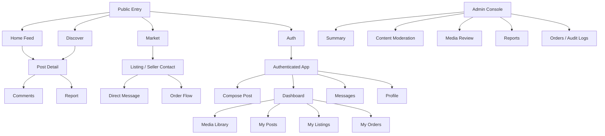
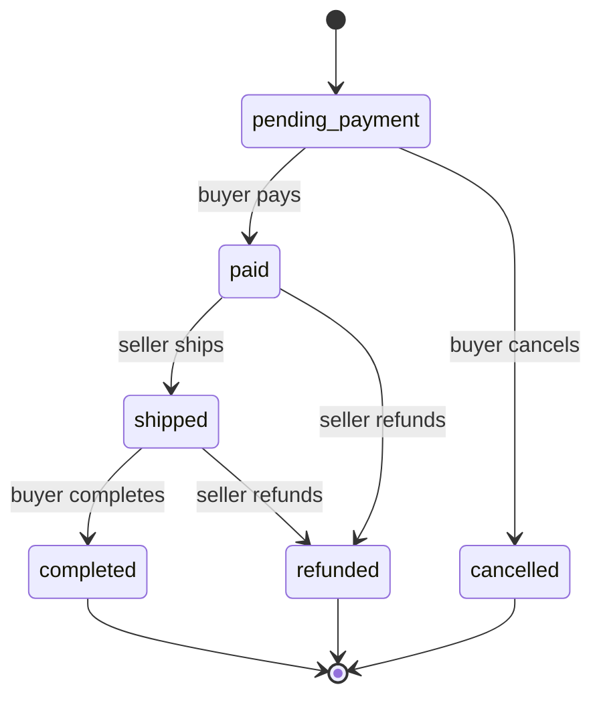
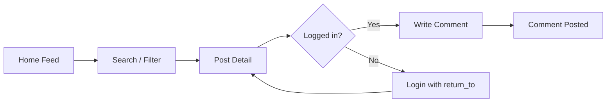
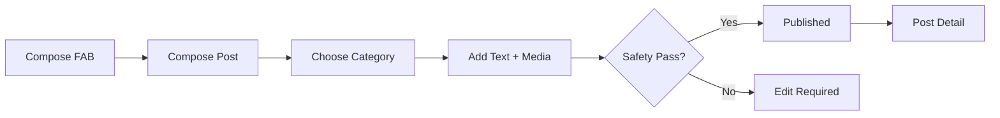
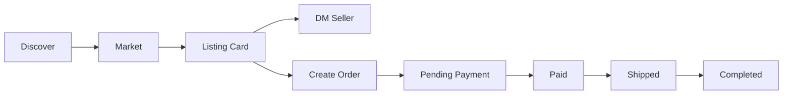
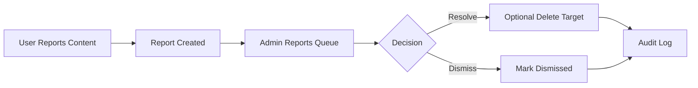

# M&D Figma Design Document

> Version: 1.0  
> Date: 2026-05-25  
> Scope: Product design, Figma structure, design system, screen inventory, interaction model, future use cases, and handoff rules.

> Current note: this is the broad product blueprint. For the current UI contract,
> token snapshot, platform mapping, and QA checklist, read
> `docs/design/MND_UI_ALIGNMENT_GUIDE.md`.

## 1. Document Purpose

This document turns the current codebase into a professional Figma-ready design blueprint for M&D = meow & doggie. It is intended for four uses:

- Product planning: clarify what the product is, who it serves, and how it can grow.
- Figma production: define pages, frames, component libraries, variants, and prototype flows.
- Engineering handoff: map UI surfaces to existing web, mobile, KMP, API, and domain models.
- Operational alignment: make moderation, commerce, trust, notifications, and admin workflows visible in the product design.

This document is the broad product blueprint. For the current implementation-facing visual contract, use `docs/design/MND_UI_ALIGNMENT_GUIDE.md`; it records the active M&D tokens, platform mapping, copy rules, and QA checklist. `DESIGN.md` remains useful historical context for older base tokens, but M&D alignment now takes precedence for user-facing UI.

## 2. Source Context

### 2.1 Current Codebase Signals

M&D is already more than a simple feed app. Current implemented capabilities include:

- Community posts, categories, tags, comments, likes, follow-filter feed.
- Marketplace listings for products, services, and adoption.
- Orders and payment state machine: pending payment, paid, shipped, completed, cancelled, refunded.
- Media upload and review: image/video upload, owner checks, status review.
- Reports, audit logs, admin moderation, and content governance.
- Notifications and direct messages.
- Public web, authenticated dashboard, admin console, Expo mobile app, KMP Android work, and shared API.
- Multi-theme and multi-language web layer.
- PostgreSQL persistence and Redis read-through cache.

### 2.2 Design Sources Of Truth

- Current UI contract: `docs/design/MND_UI_ALIGNMENT_GUIDE.md`
- Design memory: `docs/design/MND_DESIGN_MEMORY.md`
- Web bridge tokens: `web/stitch-theme-bridge.css`
- Web base tokens: `web/theme.css`
- Mobile tokens: `mobile/src/theme.ts`
- Shared RN primitives: `mobile/src/components.tsx`
- Stitch screen mapping: `web/STITCH_WEB_17.md`
- Mobile screen IDs: `mobile/src/stitch/screens.ts`
- Product/API architecture data: `web/architecture-data.json`
- Domain model: `internal/domain/models.go`
- API routes: `internal/platform/api/router.go`

## 3. Product Positioning

### 3.1 One-Sentence Positioning

M&D is a warm, trustworthy cat-first community that combines daily sharing, practical help, private messaging, local marketplace, adoption/service discovery, and platform-level safety in one coherent social-commerce experience. Dogs are included as doggie-friendly branches for activities, services, listings, and secondary stories, while the primary emotional center remains cats.

### 3.2 Product Promise

Users should feel:

- "I can record and share pet life without pressure."
- "I can find people, advice, supplies, services, and adoption information around pets."
- "Transactions and conversations feel safer because the platform has identity, reports, audit, and moderation."
- "The product feels warm and alive, but serious when money, safety, or account security is involved."

### 3.3 Design Personality

The product should feel like:

- Warm: cream canvas, soft surfaces, intimate pet-life tone.
- Trustworthy: clear status, readable forms, visible moderation and order state.
- Social: masonry content, quick reactions, comments, DMs, profiles.
- Useful: market, orders, notifications, search, admin tools.
- Professional: restrained visual noise, consistent components, clear empty/error/loading states.

## 4. Target Users

### 4.1 Core Personas

| Persona | Goal | Primary Screens | Design Need |
| --- | --- | --- | --- |
| New pet owner | Ask for help, learn care tips, find supplies | Home, Discover, Post Detail, Search | Low-friction reading, reassuring content hierarchy |
| Experienced owner | Share routines, answer questions, build presence | Compose, Profile, Comments, Follow feed | Fast publishing, identity, visible contribution |
| Buyer | Find pet products/services/adoption info | Discover, Market, Listing, DM, Orders | Trust signals, price clarity, seller contact |
| Seller/service provider | Publish listings and manage conversations/orders | Dashboard, Compose Listing, Messages, Orders | Efficient management and status clarity |
| Moderator/admin | Keep content and transactions safe | Admin, Reports, Media Review, Audit Logs | Dense but calm tools, batch scanning, clear risk states |
| Returning mobile user | Browse quickly and reply on the go | Expo tabs, Messages, Profile, Post Detail | Thumb-friendly navigation, short loops, fast states |

### 4.2 Jobs To Be Done

- When I see a pet question, I want to answer or bookmark it so I can help and build reputation.
- When I need supplies or services, I want to search trusted local listings and message the seller.
- When I buy or sell, I want to know exactly what the next order action is.
- When I upload media, I want to understand whether it is pending, approved, or rejected.
- When something feels unsafe, I want to report it and trust that the platform can act.
- When I moderate, I want to scan the riskiest content first and leave an auditable trail.

## 5. Product Architecture

### 5.1 Information Architecture



### 5.2 Navigation Model

Public web:

- Home: main feed, filters, search, hero/banner, quick entry to post detail.
- Discover: category-based exploration and market entry.
- Market: listings and seller contact path.
- Messages/Profile: visible but auth-aware.
- Login/Register: independent auth pages with return-to behavior.

Authenticated web dashboard:

- Compose post
- Compose listing
- Media library
- My posts
- My listings
- My orders
- Profile/settings
- Notifications
- Direct messages

Mobile app:

- Bottom tabs: Home, Discover, Messages, Me.
- Hidden stack routes: Market, Post Detail, Compose.
- Auth stack: Login, Register.

Admin:

- Summary
- Posts
- Comments
- Listings
- Media review
- Reports
- Orders
- Audit logs

## 6. Current Figma / Stitch Map

The repository already contains Stitch/Figma-like mapping data. Use it as the initial frame inventory when building the professional Figma document.

Project ID: `472020832926366758`

### 6.1 Front Web Desktop Frames

| Frame | Source | Stitch ID |
| --- | --- | --- |
| `HOME_DESKTOP` | `web/index.html` | `cd9894efb5c141e6895ad328663a64b0` |
| `LOGIN_DESKTOP` | `web/login.html` | `ccdaf889da834d8a839e720352980ee9` |
| `REGISTER_DESKTOP` | `web/register.html` | `4ace569b3226457ab364b5c0362ef55c` |
| `DISCOVER_DESKTOP` | `web/discover.html` | `87b58790989b4ac09c53fb50a60d9797` |
| `MESSAGES_DESKTOP` | `web/messages.html` | `3bb5216364e84f1899f07fc7fe8e2038` |
| `PROFILE_DESKTOP` | `web/profile.html` | `d39145c57af848cdadbbc15cf97c3487` |
| `POST_DETAIL_DESKTOP` | `web/post.html` | `a75de8a6450744949bdea167e327c292` |
| `COMPOSE_POST_DESKTOP` | `web/compose.html` | `cb6d98b9ae354f3e90e17d0416f9ad05` |

### 6.2 Authenticated Console / Dashboard Frames

| Frame | Source | Stitch ID |
| --- | --- | --- |
| `ADMIN_COMPOSE_POST` | `web/dashboard.html#compose-post` | `7a10ed77fc7a4f4fb9b169ab1cab4205` |
| `ADMIN_COMPOSE_LISTING` | `web/dashboard.html#compose-listing` | `7c6cce1873954c309cb55b197f5a9a64` |
| `ADMIN_MEDIA` | `web/dashboard.html#media` | `7c0bc12051204b98ae724b5b9b79d8e8` |
| `ADMIN_MY_POSTS` | `web/dashboard.html#my-posts` | `486e83f213884a7999302ec9c1f3a0af` |
| `ADMIN_MY_LISTINGS` | `web/dashboard.html#my-listings` | `8516f4328a7b419d8ae9fdaf412cfa62` |
| `ADMIN_MY_ORDERS` | `web/dashboard.html#my-orders` | `ec5bfdd3707849dda72da3c1bafe5b95` |
| `ADMIN_PROFILE` | `web/dashboard.html#profile` | `05062f3a8a09444596188cb3d26bad65` |
| `ADMIN_NOTIFICATIONS` | `web/dashboard.html#notifications` | `98220d4897c04bcaadbe0c141efe71a0` |
| `ADMIN_MESSAGES` | `web/dashboard.html#messages` | `4cf8b752667a4021989d3bfabf894031` |

### 6.3 Mobile Frames

| Frame | Source | Stitch ID |
| --- | --- | --- |
| `HOME_MOBILE` | `mobile/app/(tabs)/index.tsx` | `24394474a8fb461691446c023767549f` |
| `DISCOVER_MOBILE` | `mobile/app/(tabs)/discover.tsx` | `c4356b5a317846ae8d58ffa3ec723154` |
| `MESSAGES_MOBILE` | `mobile/app/(tabs)/messages` | `855b3e0ba0194e9aaa07f2b0237c075f` |
| `PROFILE_MOBILE` | `mobile/app/(tabs)/profile.tsx` | `072b7dd565914b8e835a6260878aa0ee` |
| `POST_DETAIL_MOBILE` | `mobile/app/(tabs)/post/[id].tsx` | `56969a3c2b064bd1976cf418ec4d32e2` |
| `COMPOSE_POST_MOBILE` | `mobile/app/(tabs)/compose.tsx` | `300abed7f6aa4aef9e4a02b95e093059` |
| `LOGIN_MOBILE` | `mobile/app/(auth)/login.tsx` | `11540204191034377071` |
| `REGISTER_MOBILE` | `mobile/app/(auth)/register.tsx` | `62e4e647722245a88e07d5801560ada1` |
| `SPLASH_MOBILE` | Expo splash/app config | `ea5847d8c0fd4dc7b14e62893aad56ee` |
| `LOADING_MOBILE` | `KittyLoader` / skeleton state | `550bdee1020e465c9cc49aaf46de7ec8` |
| `DETAIL_LOADING_MOBILE` | detail skeleton | `306a6d8179f14973a4156e69ec84ff14` |
| `APP_ICON` | Expo icon/adaptive icon | `5105072463b444239544a7c5ca2215fe` |

## 7. Recommended Figma File Structure

Create one Figma file named:

`M&D - Product Design System & App Blueprint`

Recommended pages:

| Page | Purpose |
| --- | --- |
| `00 Cover` | Product statement, version, contributors, source links |
| `01 Product Strategy` | personas, JTBD, use cases, roadmap, metrics |
| `02 Information Architecture` | navigation map, routes, user flows |
| `03 Design System - Tokens` | colors, typography, spacing, radii, elevation, motion |
| `04 Design System - Components` | reusable components and variants |
| `05 Web - Public` | home, discover, market, post detail, auth |
| `06 Web - Dashboard` | authenticated console screens |
| `07 Mobile App` | Expo mobile screens and native states |
| `08 Admin & Trust` | moderation, reports, audit, order review |
| `09 Prototype Flows` | clickable flows for browse, publish, buy, moderate |
| `10 Future Concepts` | planned use cases, growth loops, monetization concepts |
| `99 Archive` | old explorations and replaced variants |

### 7.1 Naming Convention

Use stable names that can survive handoff:

- `Screen / Platform / State / Breakpoint`
- Examples:
  - `Home / Web / Default / 1440`
  - `Home / Mobile / Empty / 393`
  - `Order Detail / Dashboard / Paid / 1440`
  - `Media Review / Admin / Pending Queue / 1440`
  - `Button / Primary / Default`

### 7.2 Frame Sizes

| Breakpoint | Size | Use |
| --- | --- | --- |
| Desktop | `1440 x auto` | Main web and admin design |
| Laptop | `1280 x auto` | Dense dashboard validation |
| Tablet | `834 x auto` | iPad and responsive web |
| Mobile | `393 x 852` | iPhone 15-ish baseline |
| Small mobile | `360 x 780` | Android low-width check |

## 8. Visual Design System

### 8.1 Brand Theme

The visual language should keep the existing warm cream and petal/crimson direction. The product should not become a generic blue-gray SaaS UI. It should feel like a polished lifestyle community with enough structure for commerce and admin safety.

Design principles:

- Cream canvas over pure white.
- Near-black ink for long reading.
- Petal/crimson accent for active, primary, and emotional moments.
- Gold/amber for secondary highlights and marketplace warmth.
- Green/teal for success and completion.
- Red should be reserved for destructive/error states in admin and forms.
- Cards should be soft, but not nested into decorative layers.
- Marketplace and admin screens need higher information density than the community feed.

### 8.2 Current Token Bridge

| Role | Web Token | Mobile Token | Notes |
| --- | --- | --- | --- |
| Canvas | `--bg` / `#f2f1ed` | `colors.canvas` / `#F9F7F2` | Warm base surface |
| Card | `--card` | `colors.surface` | Main content blocks |
| Text | `--text` / `#26251e` | `colors.onSurface` / `#1b1c19` | Warm ink |
| Muted text | `--muted` | `colors.onSurfaceVariant` | Metadata and helper copy |
| Primary accent | `--brand` / `--danger` depending context | `colors.primaryContainer` / `#ff5a77` | Web and mobile currently differ slightly; align naming in Figma |
| Success | `--ok` | `colors.tertiary` | Completion, approved, paid/shipped positive |
| Border | `--border` | `colors.border` | Hairline and card borders |
| Radius | `--r-md`, `--r-pill` | `radius.md`, `radius.pill` | Use 8/12/16/24/32/pill scale |

### 8.3 Typography

Web currently uses Inter, EB Garamond, and JetBrains Mono as free drop-ins for the Cursor-inspired trio. Mobile uses Plus Jakarta Sans. In Figma:

- Define a cross-platform type system first, then document platform substitutions.
- Use display type sparingly for mastheads and brand moments.
- Use compact UI type for dashboard and admin.
- Use monospaced type for IDs, audit log metadata, API/status labels, and debug-like details.

Recommended Figma text styles:

| Style | Web Approx | Mobile Approx | Use |
| --- | --- | --- | --- |
| `Display/Hero` | 52-64px | 28-32px | Brand, campaign banner |
| `Heading/H1` | 36-44px | 24px | Screen title |
| `Heading/H2` | 26-32px | 22px | Section title |
| `Heading/H3` | 18-22px | 17px | Card title |
| `Body/Default` | 16px | 16px | Main copy |
| `Body/Small` | 14px | 14px | Metadata, helper text |
| `Label` | 12-13px | 12px | Chips, nav, buttons |
| `Mono/Small` | 12px | 13px | IDs, audit, code-like values |

### 8.4 Spacing And Density

Base spacing:

- `4`, `8`, `12`, `16`, `24`, `32`, `48`, `64`.

Use:

- Feed/mobile content: 16-24 outer padding, 12-16 inner gaps.
- Dashboard/admin: 16-24 section gaps, denser tables and queues.
- Forms: 12 field gap, 24 group gap.
- Marketplace listing cards: 16-20 inner padding, price and CTA visually separated.

## 9. Component Inventory

### 9.1 Core Components

| Component | Variants | Current Code Source | Figma Notes |
| --- | --- | --- | --- |
| App shell | public web, dashboard, admin, mobile tabs | `web/*.html`, `mobile/app/(tabs)/_layout.tsx` | Separate nav variants by platform |
| Top bar | guest, logged-in, with search, with notification | `StitchTopBar`, `web/index.html` | Avatar and notification badge states |
| Bottom tab bar | active/inactive, badge, safe-area | `mobile/app/(tabs)/_layout.tsx` | Mobile component with height token |
| Button | primary, secondary, ghost, danger, icon | `mobile/src/components.tsx`, `web/theme.css` | Include loading and disabled |
| Text input | default, focus, error, with label, search | `Input`, `StitchSearchField` | Search gets icon and clear state |
| Card | feed, listing, message, profile, stat, admin panel | Web/RN card styles | Avoid nested card patterns |
| Pill/chip | category, selected, neutral, brand | `Pill`, feed filters | Need category color mapping |
| Feed tile | image, text-only, tall/short, liked | `FeedTile`, masonry layout | Define media fallback state |
| Comment item | author, timestamp, body, report action | post detail screens | Include empty/loading |
| Listing card | product, service, adopt | market screens | Price, seller, DM, order CTA |
| Order row/card | each order status | dashboard/API order model | Status-driven actions |
| Message row | unread/read, active, empty | messages screens | Include badge and timestamp |
| Notification item | comment, order, report, system, message | domain model | Actor image and preview support |
| Media item | pending, approved, rejected, video/image | media library/admin review | Approval actions and rejection state |
| Report item | open, resolved, dismissed | admin reports | Include target preview |
| Audit log row | action, actor, target, IP, timestamp | admin audit | Dense table/list style |

### 9.2 Status System

Map backend states to UI status treatments:

| Domain | States | UI Treatment |
| --- | --- | --- |
| Media | pending, approved, rejected | amber pending, green approved, red rejected |
| Report | open, resolved, dismissed | red/amber open, green resolved, neutral dismissed |
| Order | pending_payment, paid, shipped, completed, cancelled, refunded | timeline stepper plus action CTA |
| Notification | unread/read | unread marker, stronger text, badge count |
| Message | unread/read | badge + bold conversation preview |

## 10. Key Screens

### 10.1 Home Feed

Purpose: high-frequency entry for reading and lightweight social discovery.

Must include:

- Top bar with brand, avatar, notification entry.
- Feed filters: recommended, latest, following.
- Search field.
- Seasonal/community banner.
- Masonry two-column feed on mobile; responsive grid on web.
- Feed tile with category, title, media/preview, author/time, like state.
- Floating compose action.

States:

- Loading skeleton.
- Empty feed.
- Following feed requires login.
- Network error.
- Search no results.

### 10.2 Discover

Purpose: category exploration and entry into market.

Must include:

- Category chips: all, daily share, help, activity, trade.
- Market entry card.
- Feed filtered by category.
- Same feed tile behavior as Home.

Future enhancement:

- Circles/topics landing.
- Nearby events.
- Expert Q&A.

### 10.3 Post Detail

Purpose: read, react, comment, and escalate if unsafe.

Must include:

- Back navigation.
- Author area.
- Category/tags.
- Title and content.
- Media gallery.
- Like count.
- Comments.
- Comment input.
- Report action.
- DM author entry where appropriate.

States:

- Loading detail.
- Not found.
- Auth required for comment.
- Comment rejected by content filter.

### 10.4 Compose Post

Purpose: fast creation with enough structure for discovery and moderation.

Must include:

- Title, content, category, tags.
- Media attachment selector.
- Preview of selected media.
- Submission loading.
- Content safety error.
- Success redirect.

Design rule:

- Publishing should feel encouraging but not childish.
- Category selection should be clear and thumb-friendly.
- Error copy should explain what to change.

### 10.5 Market

Purpose: commerce discovery for supplies, services, and adoption.

Must include:

- Listing type pill.
- Title and description.
- Price and currency.
- Seller identity.
- DM seller CTA.
- Future order CTA.

Future states:

- Verified seller.
- Local distance.
- Availability.
- Saved listing.
- Buyer protection.

### 10.6 Orders

Purpose: make buyer/seller next action obvious.

Order flow:



Design requirement:

- Each order card must answer: "What is the current status?", "Who acts next?", "What can I do?"
- Buyer and seller tabs must share component structure but differ actions.
- Terminal states must reduce visual urgency.

### 10.7 Messages

Purpose: keep social and commerce conversations lightweight.

Must include:

- Conversation list.
- Unread count.
- Last message preview.
- Timestamp.
- Start new conversation.
- Direct conversation thread with input and send state.

Future:

- Listing/order context card pinned inside commerce chat.
- Safety notice for first-time seller contact.
- Attachment support.

### 10.8 Profile

Purpose: identity, credibility, and owned content.

Must include:

- Avatar or placeholder.
- Nickname, username, bio.
- Dynamic counts: posts, following, followers.
- My posts grid.
- Logout action.

Future:

- Pet profiles linked to user.
- Reputation badges.
- Reviews.
- Saved posts/listings.

### 10.9 Dashboard

Purpose: power-user workspace for managing content, media, orders, and messages.

Must include:

- Left/side nav on desktop; horizontal nav on narrow web.
- Compose post.
- Compose listing.
- Media library.
- My posts/listings.
- Orders buyer/seller role switch.
- Profile/settings.
- Notifications.
- Messages.

Design requirement:

- Dashboard should be denser and more tool-like than feed.
- Use segmented controls for role filters and category tabs.
- Use icon buttons for notification/settings/messages where labels are redundant.

### 10.10 Admin Console

Purpose: trust and safety operations.

Must include:

- Admin key authentication state.
- Summary metrics.
- Posts/comments/listings moderation.
- Media review queue.
- Report handling.
- Order overview.
- Audit logs.

Design requirement:

- Admin must prioritize scanning and decision-making.
- Use tables or compact lists, not large lifestyle cards.
- Dangerous actions must have confirmation and clear red treatment.
- Every moderation decision should show target, actor, time, and consequence.

## 11. Professional Use-Case Expansion

The current backend already supports enough primitives to grow into several product lines. These should be shown in Figma as future concept frames, not mixed into MVP screens until prioritized.

### 11.1 Pet Identity Layer

Use case:

- Each user can create one or more pet profiles with name, breed/species, age, health notes, photos, and milestones.

Why:

- Turns generic social account into pet-centered identity.
- Enables care reminders, content personalization, and community matching.

Figma concepts:

- `Pet Profile / Mobile / Overview`
- `Pet Timeline / Mobile / Growth Diary`
- `Pet Switcher / Component`

### 11.2 Care Diary And Reminder System

Use case:

- Vaccines, deworming, grooming, medication, food changes, weight tracking.

Why:

- High retention loop beyond browsing.
- Good bridge to services and marketplace.

Figma concepts:

- `Care Calendar / Mobile`
- `Reminder Card / Component`
- `Health Event / Create Flow`

### 11.3 Expert Q&A / Verified Advice

Use case:

- Verified veterinarians, trainers, groomers, rescue groups, and experienced users answer questions.

Why:

- Increases trust and quality.
- Gives "help" category a stronger product shape.

Figma concepts:

- `Question Detail / Expert Answer`
- `Expert Badge / Component`
- `Ask Expert / Compose Variant`

### 11.4 Local Circles And Events

Use case:

- City/community circles, offline meetups, adoption days, charity events.

Why:

- Makes the product local and socially sticky.
- Can reuse activity category and post model at first.

Figma concepts:

- `Circle Detail / Web`
- `Event Card / Component`
- `Nearby Feed / Mobile`

### 11.5 Adoption Flow

Use case:

- Adoption listings with application, screening checklist, status updates, and post-adoption follow-up.

Why:

- Adoption is already a listing type, but needs higher trust and care than normal commerce.

Figma concepts:

- `Adoption Listing / Detail`
- `Adoption Application / Form`
- `Adoption Safety Checklist / Component`

### 11.6 Marketplace Trust And Reputation

Use case:

- Seller verification, reviews, order completion history, response rate, dispute/report history.

Why:

- Necessary before marketplace scaling.

Figma concepts:

- `Seller Profile / Trust Summary`
- `Listing Detail / Buyer Protection`
- `Review Card / Component`

### 11.7 Moderation Operations 2.0

Use case:

- Risk queues, content similarity, repeat offender signals, report SLAs.

Why:

- Current admin primitives are ready for a more professional operations console.

Figma concepts:

- `Trust Queue / Admin / Priority`
- `Report Detail / Admin`
- `Audit Timeline / Component`

### 11.8 Creator And Brand Programs

Use case:

- Pet creators, local pet stores, clinics, rescue organizations, sponsored posts.

Why:

- Monetization without harming core community if clearly labeled.

Figma concepts:

- `Creator Profile / Web`
- `Sponsored Listing / Component`
- `Brand Dashboard / Concept`

## 12. Prototype Flows

### 12.1 Browse To Comment



### 12.2 Publish Post



### 12.3 Marketplace To Order



### 12.4 Report And Moderate



## 13. Copywriting Guidelines

Tone:

- Warm, direct, not childish.
- Clear when something goes wrong.
- No internal field names in user-facing errors.
- Marketplace and orders should be more precise than feed copy.

Examples:

| Context | Recommended Copy |
| --- | --- |
| Empty feed | `还没有动态。发布第一条，给大家一个认识你的机会。` |
| Following empty | `关注几位 M&D 伙伴后，这里会变成你的专属动态流。` |
| Market empty | `暂时没有上架内容。可以先发布一个闲置、服务或领养信息。` |
| Auth required | `登录后可以继续这个操作，回来时会保留当前位置。` |
| Safety rejection | `内容里可能包含不适合发布的词语。调整后再试一次。` |
| Order next action | `等待买家付款` / `卖家可以发货` / `买家可确认收货` |

## 14. Accessibility And Internationalization

Accessibility:

- All icon-only buttons need accessible labels.
- Touch targets should be at least 44 x 44 on mobile.
- Contrast must pass for normal text and controls.
- Do not rely only on color for order/media/report states; include labels.
- Loading and empty states must have text, not only animation.
- Reduced motion should disable non-essential movement.

Internationalization:

- Web already supports Chinese, English, Japanese copy through `web/shared.js`.
- Figma components should allow longer English/Japanese labels without overflow.
- Avoid fixed-width text containers for buttons and chips.
- Maintain a glossary for post/listing/order/admin terms.

## 15. Metrics And Success Criteria

### 15.1 Community Metrics

- Feed engagement: post detail opens, likes, comments per post.
- Creator activation: new posts per active user.
- Follow graph: follow action rate, followed-feed retention.
- Search success: search to detail-open rate.

### 15.2 Marketplace Metrics

- Listing creation rate.
- Listing to DM rate.
- Order creation rate.
- Payment completion rate.
- Refund/cancel rate.

### 15.3 Trust And Safety Metrics

- Reports per 1,000 posts/listings/messages.
- Median report resolution time.
- Media approval time.
- Repeat report rate.
- Admin action audit completeness.

### 15.4 Mobile Metrics

- Auth completion.
- Push/notification open rate once push is added.
- Time to first post.
- Message reply rate.

## 16. Figma Handoff Rules

Every screen frame should include:

- Frame name and route/source path.
- Primary user goal.
- Required data model fields.
- Empty/loading/error states.
- Interaction notes.
- Responsive behavior.
- Component references.
- Acceptance checklist.

Example handoff annotation:

```text
Screen: Home / Mobile / Default / 393
Route: mobile/app/(tabs)/index.tsx
Primary goal: browse recommended pet posts and publish quickly
Data: PostFeedItem, User, like counts, follow filter
Components: TopBar, SearchField, FilterChip, FeedTile, MasonryTwoCol, FAB
States: loading, empty, error, following-auth-required, search-empty
```

## 17. Implementation Alignment

### 17.1 Current Routes To Design Surfaces

| Product Surface | Web | Mobile | API/Domain |
| --- | --- | --- | --- |
| Auth | `login.html`, `register.html` | `(auth)/login`, `(auth)/register` | `User`, JWT |
| Feed | `index.html` | `(tabs)/index` | `Post`, like/follow APIs |
| Discover | `discover.html` | `(tabs)/discover` | `PostCategory`, search |
| Post detail | `post.html` | `(tabs)/post/[id]` | `Post`, `Comment`, `Media` |
| Compose post | `compose.html`, dashboard | `(tabs)/compose` | `CreatePost`, media ownership |
| Market | `market.html`, dashboard listing | `(tabs)/market` | `Listing`, `Order` |
| Messages | `messages.html`, dashboard | `(tabs)/messages` | `Message`, `Conversation` |
| Profile | `profile.html`, dashboard | `(tabs)/profile` | `User`, user posts |
| Notifications | dashboard | future mobile inbox | `Notification` |
| Admin | `admin.html` | not mobile-first | reports/media/orders/audit |

### 17.2 Engineering Acceptance Checklist

- Uses existing tokens before adding new colors or spacing.
- Reuses component primitives where possible.
- Has loading, empty, error, and auth-required states.
- Matches responsive behavior at desktop, tablet, and mobile.
- Preserves API envelope and auth behavior.
- Does not invent backend states that do not exist without roadmap annotation.
- Provides admin actions with confirmation and audit visibility.

## 18. Design Roadmap

### Phase A: Clean Figma System Foundation

- Create pages and frame inventory.
- Convert tokens from `web/theme.css` and `mobile/src/theme.ts` into Figma variables.
- Build core components: buttons, inputs, chips, cards, nav, tabs, status badges.
- Rebuild existing mobile frames from current Expo screens.

### Phase B: Product Flow Prototypes

- Browse to comment.
- Login/register with return-to.
- Compose post with media.
- Listing to message/order.
- Buyer/seller order lifecycle.
- Report to admin resolution.

### Phase C: Professional Console And Trust Layer

- Redesign dashboard as a creator/seller workspace.
- Redesign admin as a dense operations console.
- Add report detail, media detail, audit timeline, and risk states.

### Phase D: Expansion Concepts

- Pet profiles.
- Care diary/reminders.
- Verified Q&A.
- Local circles/events.
- Adoption flow.
- Seller trust/reviews.
- Brand/creator program.

## 19. Recommended Immediate Figma Work Order

1. Build `03 Design System - Tokens` from existing web/mobile tokens.
2. Build `04 Design System - Components` with variants and states.
3. Recreate `HOME_MOBILE`, `DISCOVER_MOBILE`, `POST_DETAIL_MOBILE`, `COMPOSE_POST_MOBILE`.
4. Recreate `HOME_DESKTOP`, `DISCOVER_DESKTOP`, `MARKET_DESKTOP`, `POST_DETAIL_DESKTOP`.
5. Create missing high-value screens: listing detail, order detail, report flow, admin report detail.
6. Create prototype flows for browse/comment, publish, marketplace/order, report/moderate.
7. Add `10 Future Concepts` frames for pet profile, care diary, verified Q&A, adoption.

## 20. Final Design Bar

A professional M&D design is successful when:

- The feed feels warm and alive.
- Commerce feels clear and trustworthy.
- Admin feels efficient and serious.
- Mobile feels native and thumb-friendly.
- Empty/loading/error states are as carefully designed as happy paths.
- The Figma file can guide engineering without extra explanation.
- Future product ideas are visible but separated from MVP scope.
